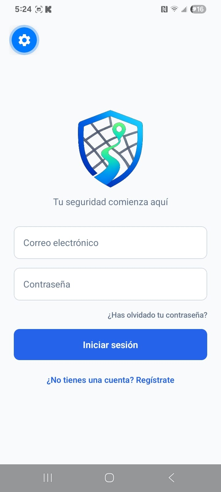
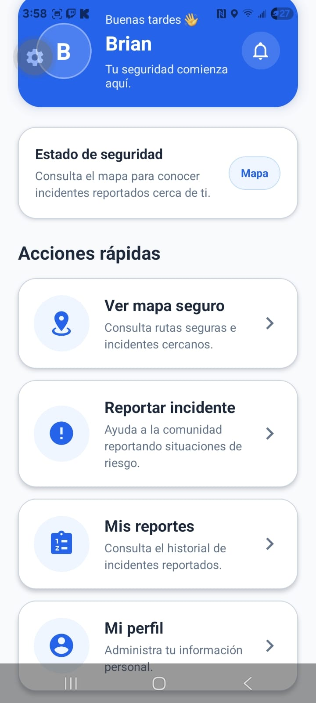
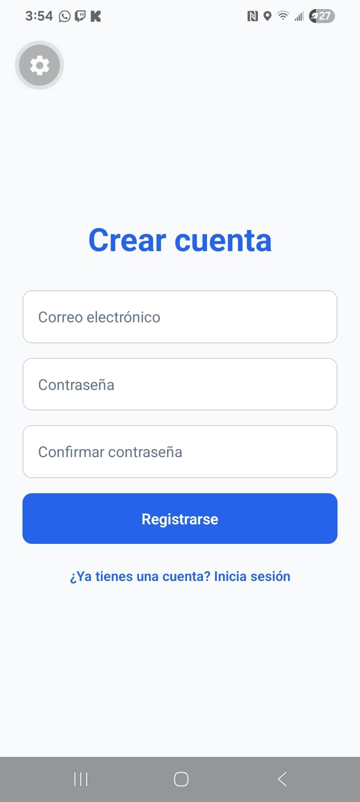
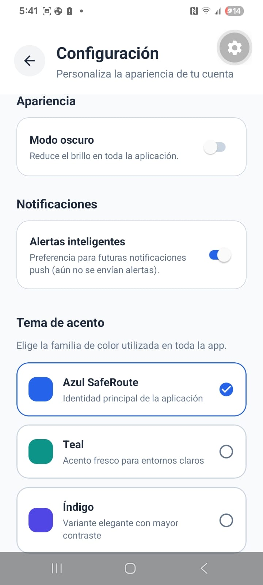
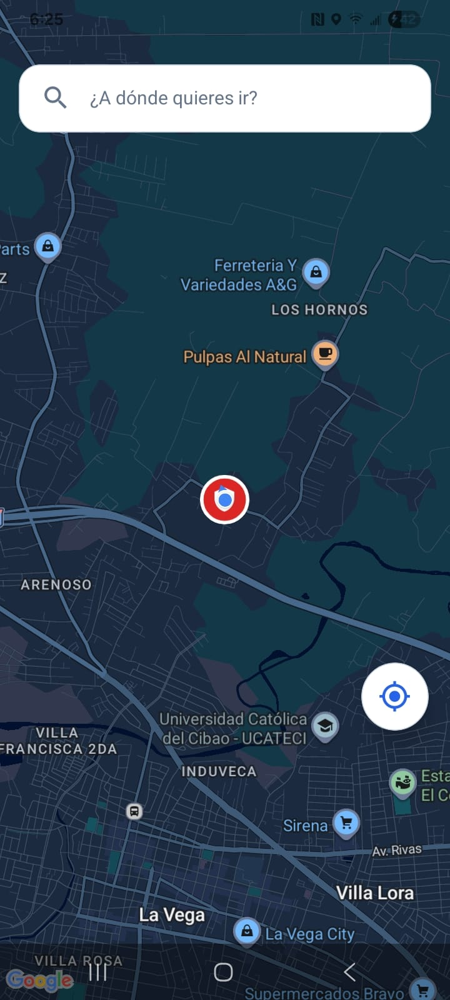
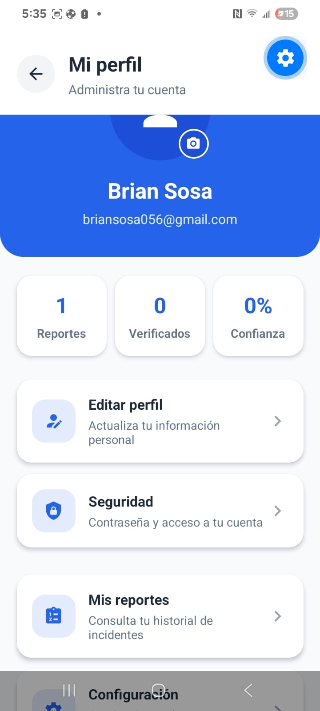
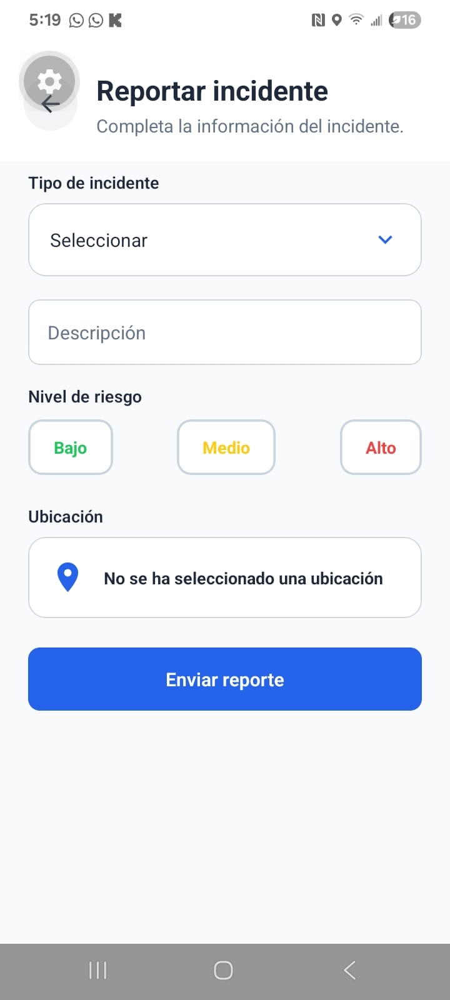

# SafeRoute

<p align="center">
  
</p>

<h2 align="center">
Sistema Inteligente para la Planificación de Rutas Seguras mediante Geolocalización y Reportes Comunitarios
</h2>

<p align="center">


</p>

---

# Descripción

SafeRoute es una aplicación móvil desarrollada con **React Native** y **Expo**, diseñada para ayudar a los usuarios a desplazarse de una manera más segura mediante el uso de geolocalización, mapas interactivos y reportes comunitarios.

La aplicación permite consultar incidentes registrados por otros usuarios, buscar destinos utilizando Google Places, calcular rutas mediante Google Routes API y reportar nuevas incidencias desde el dispositivo móvil. Toda la información es administrada mediante Firebase Authentication y Cloud Firestore, permitiendo mantener un sistema seguro, escalable y de fácil mantenimiento.

Este proyecto fue desarrollado como parte de un proyecto académico de la carrera de Ingeniería en Software de la Universidad Abierta Para Adultos (UAPA), aplicando el patrón de arquitectura MVVM para garantizar una correcta organización del código y facilitar futuras ampliaciones.

---

# Información general

| Información | Detalle |
|-------------|----------|
| Nombre | SafeRoute |
| Versión | 1.0 |
| Plataforma | Android |
| Arquitectura | MVVM |
| Lenguaje | TypeScript |
| Framework | React Native + Expo |
| Base de datos | Cloud Firestore |
| Autenticación | Firebase Authentication |
| Servicios | Google Maps Platform |

---

# Características principales

- Registro de usuarios.
- Inicio de sesión seguro.
- Recuperación de contraseña.
- Visualización del mapa interactivo.
- Ubicación actual del usuario.
- Búsqueda inteligente de lugares.
- Cálculo de rutas.
- Visualización de incidentes.
- Reporte de nuevos incidentes.
- Administración del perfil.
- Cambio de contraseña.
- Configuración de la aplicación.
- Modo oscuro.
- Pull To Refresh.
- Diseño moderno y adaptable.

---

# Funcionalidades

SafeRoute incorpora diferentes herramientas que buscan mejorar la experiencia del usuario durante sus desplazamientos.

Entre las principales funcionalidades implementadas se encuentran:

- Registro de usuarios mediante Firebase Authentication.
- Inicio de sesión seguro.
- Recuperación de contraseña.
- Consulta del mapa utilizando Google Maps.
- Obtención de la ubicación actual.
- Búsqueda inteligente de lugares.
- Cálculo de rutas mediante Google Routes API.
- Visualización de incidentes reportados.
- Registro de nuevos incidentes.
- Gestión del perfil del usuario.
- Cambio de contraseña.
- Configuración de preferencias.
- Tema claro y tema oscuro.
- Actualización mediante Pull To Refresh.

---
# Tecnologías utilizadas

El desarrollo de SafeRoute se realizó utilizando tecnologías modernas que permiten crear aplicaciones móviles robustas, escalables y de fácil mantenimiento.

| Tecnología | Uso |
|------------|-----|
| React Native | Desarrollo de la aplicación móvil |
| Expo | Plataforma de desarrollo y compilación |
| TypeScript | Lenguaje principal del proyecto |
| Firebase Authentication | Gestión de usuarios |
| Cloud Firestore | Base de datos NoSQL |
| Google Maps SDK | Visualización del mapa |
| Google Places API | Búsqueda inteligente de lugares |
| Google Routes API | Cálculo de rutas |
| Expo Location | Geolocalización |
| Expo Router | Navegación entre pantallas |
| React Navigation | Gestión de navegación interna |

---

# Arquitectura

El proyecto fue desarrollado siguiendo el patrón de arquitectura **MVVM (Model - View - ViewModel)**, el cual permite separar la lógica de negocio de la interfaz gráfica, facilitando el mantenimiento, las pruebas y la escalabilidad de la aplicación.

Cada pantalla delega la lógica de negocio a un ViewModel, mientras que los servicios se encargan de la comunicación con Firebase y las APIs externas.

```text
Usuario
    │
    ▼
Screens
    │
    ▼
ViewModels
    │
    ▼
Services
    │
    ▼
Firebase / Google APIs
```

Esta arquitectura facilita la reutilización del código, mejora la organización del proyecto y permite incorporar nuevas funcionalidades sin afectar las existentes.

---

# Estructura del proyecto

```text
SafeRoute
│
├── assets/
│
├── docs/
│   ├── images/
│   ├── Documentacion_Tecnica.pdf
│   └── Manual_Usuario.pdf
│
├── src/
│   ├── components/
│   ├── config/
│   ├── context/
│   ├── navigation/
│   ├── screens/
│   ├── services/
│   ├── styles/
│   ├── utils/
│   └── viewmodels/
│
├── app.json
├── eas.json
├── package.json
├── tsconfig.json
└── README.md
```

La organización del proyecto sigue una estructura modular que facilita la separación de responsabilidades y mejora la mantenibilidad del código.

---

# Requisitos

Para ejecutar correctamente el proyecto es necesario contar con:

- Node.js 20 o superior.
- npm.
- Expo CLI.
- Android Studio o Expo Go.
- Cuenta de Firebase.
- Claves habilitadas de Google Maps Platform.
- Conexión a Internet.

---

# Instalación

## 1. Clonar el repositorio

```bash
git clone https://github.com/BrianSs24/SafeRoute.git
```

## 2. Acceder al proyecto

```bash
cd SafeRoute
```

## 3. Instalar las dependencias

```bash
npm install
```

## 4. Ejecutar el proyecto

```bash
npx expo start
```

## 5. Ejecutar en un dispositivo

- Escanee el código QR utilizando **Expo Go**, o
- Ejecute el proyecto en un emulador de Android desde Android Studio.

---
# Capturas de pantalla

A continuación se muestran algunas de las principales pantallas desarrolladas durante el proyecto.

## Inicio de sesión y pantalla principal

| Inicio de sesión | Pantalla principal |
|------------------|--------------------|
|  |  |

---

## Registro y configuración

| Registro | Configuración |
|----------|---------------|
|  |  |

---

## Mapa y perfil

| Mapa | Perfil |
|------|---------|
|  |  |

---

## Reporte de incidentes

| Reportar incidente |
|--------------------|
|  |

---

# Documentación

Toda la documentación del proyecto se encuentra disponible dentro de la carpeta **docs**.

| Documento | Descripción |
|-----------|-------------|
| Documentación Técnica | Describe la arquitectura del sistema, tecnologías utilizadas, modelo de datos, decisiones de diseño y pruebas realizadas durante el desarrollo. |
| Manual de Usuario | Explica el proceso de instalación y el uso de la aplicación paso a paso con capturas de pantalla. |

### Estructura

```text
docs
│
├── images
│
├── Documentacion_Tecnica.pdf
│
└── Manual_Usuario.pdf
```

---

# Equipo de desarrollo

Este proyecto fue desarrollado por estudiantes de la carrera de Ingeniería en Software de la Universidad Abierta Para Adultos (UAPA).

**Integrantes**

- Brian Sosa
- *(Agregar nombre del integrante 2)*
- *(Agregar nombre del integrante 3)*
- *(Agregar nombre del integrante 4, si aplica)*

---

# Contribuciones

Este proyecto fue desarrollado con fines académicos.

Las sugerencias de mejora, correcciones y nuevas funcionalidades pueden realizarse mediante la creación de **Issues** o **Pull Requests** en este repositorio.

---

# Mejoras futuras

Aunque SafeRoute ya incorpora las funcionalidades principales, existen diversas mejoras que podrían implementarse en versiones futuras:

- Notificaciones Push.
- Navegación en tiempo real.
- Reportes con fotografías.
- Chat entre usuarios.
- Sistema de reputación comunitaria.
- Panel administrativo web.
- Estadísticas avanzadas de incidentes.
- Historial de rutas recorridas.
- Compartir ubicación en tiempo real.
- Inteligencia artificial para clasificación automática de incidentes.

---
# Agradecimientos

Queremos expresar nuestro agradecimiento a la **Universidad Abierta Para Adultos (UAPA)** y al docente de la asignatura por el acompañamiento y las orientaciones brindadas durante el desarrollo de este proyecto.

También agradecemos a todas las personas que participaron en las pruebas de la aplicación y aportaron sugerencias que contribuyeron a mejorar la experiencia de usuario y la calidad del producto final.

El desarrollo de SafeRoute representó una excelente oportunidad para aplicar conocimientos relacionados con desarrollo móvil, arquitectura de software, bases de datos en la nube, geolocalización e integración de servicios externos.

---

# Licencia

Este proyecto fue desarrollado exclusivamente con fines académicos como parte de la carrera de **Ingeniería en Software** de la **Universidad Abierta Para Adultos (UAPA)**.

El código fuente puede utilizarse como referencia educativa, respetando los derechos de autor de sus desarrolladores.

---

# Estado del proyecto

| Estado | Valor |
|---------|-------|
| Versión | 1.0 |
| Estado | Finalizado |
| Plataforma | Android |
| Arquitectura | MVVM |
| Desarrollo | React Native + Expo |
| Base de datos | Cloud Firestore |
| Autenticación | Firebase Authentication |
| Última actualización | Julio 2026 |

---

# Características destacadas

- Arquitectura MVVM.
- Desarrollo con React Native y Expo.
- Firebase Authentication.
- Cloud Firestore.
- Google Maps Platform.
- Google Places API.
- Google Routes API.
- Geolocalización en tiempo real.
- Reportes comunitarios.
- Perfil de usuario.
- Recuperación de contraseña.
- Modo oscuro.
- Interfaz moderna y adaptable.

---

# Contacto

Si deseas conocer más sobre este proyecto o realizar alguna consulta relacionada con su desarrollo, puedes contactar al equipo mediante GitHub.

**Repositorio oficial:**

https://github.com/BrianSs24/SafeRoute

---

<p align="center">

Desarrollado con amor utilizando React Native, Expo y Firebase.

**SafeRoute © 2026**

</p>
